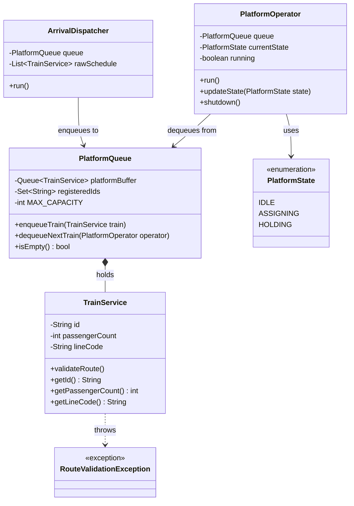
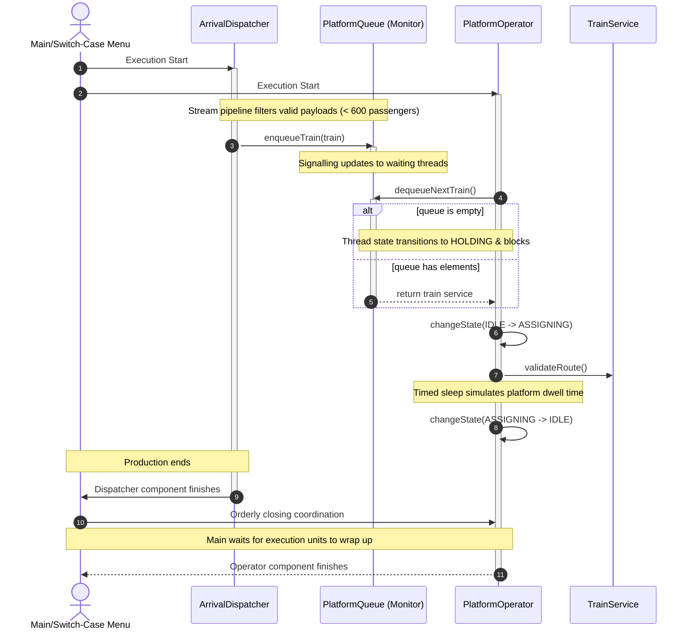

# TEST 3: Multi-Threaded Train Station Platform Allocation System

You will simulate a modern train station control room where an automated dispatcher queues incoming train services into a shared allocation buffer, and multiple platform operators work concurrently to assign them to platforms.

The system must process data safely in a multi-threaded environment and utilize modern Java functional pipelines to manage train flow.

## 1. Requirements & Grading Rubric

| Req. Code | Description                                                                                                                                                                                                                                                                                                                                                                                                                                                                                                                                                                                                                                                                                                                                                                                                                                                                       | Max Points |
| :---: |:----------------------------------------------------------------------------------------------------------------------------------------------------------------------------------------------------------------------------------------------------------------------------------------------------------------------------------------------------------------------------------------------------------------------------------------------------------------------------------------------------------------------------------------------------------------------------------------------------------------------------------------------------------------------------------------------------------------------------------------------------------------------------------------------------------------------------------------------------------------------------------|:----------:|
| **REQ-1** | **Train Service Model & Core Integrity:**   Implement a data component to represent a `TrainService` with the following attributes: `id` (String), `passengerCount` (int), and `lineCode` (String).    * **Implementation Option A (Classic):** Define a standard class with a constructor and public accessor methods (getters).   * **Implementation Option B (Modern):** Define a single-line Java `record`.  `public record TrainService(String id, int passengerCount, String lineCode) {}`   Records automatically generate getter, setter, hashCode, etc.    To ensure system integrity and prevent duplicate processing, use a Hash-based collection (such as a `HashSet` or `HashMap`) to track unique train service IDs globally. If a service arrives with an ID that has already been registered in the collection, skip it or handle the duplication appropriately. |  **1.0p**  |
| **REQ-2** | **Functional Filtering Pipeline:**   Before data enters the active allocation queue, the system must filter incoming train batches using a **Java Stream pipeline with a lambda expression**. It must automatically filter out over-capacity trains ($>600$ passengers) and redirect them to an alternative oversight or logging logic. This streaming operation should be invoked either from `main()` or within a dedicated coordinator component before the items are submitted to the queue.                                                                                                                                                                                                                                                                                                                                                                                    |  **1.0p**  |
| **REQ-3** | **Active Dispatcher Component:**   Implement an `ArrivalDispatcher` component. This component acts as an independent execution unit that simulates real-time train arrivals by generating batches of valid services at random time intervals and depositing them into the shared platform queue. *(Choose the appropriate multi-threading mechanism).*                                                                                                                                                                                                                                                                                                                                                                                                                                                                                                                                   |  **1.0p**  |
| **REQ-4** | **Platform Operator Components:**   Implement a `PlatformOperator` component. Multiple platform operator instances must run concurrently, acting as independent execution units that continuously pull train services from the shared allocation queue to assign platforms. *(Choose the appropriate multi-threading mechanism).*                                                                                                                                                                                                                                                                                                                                                                                                                                                                                                                                                                     |  **1.0p**  |
| **REQ-5** | **Thread Synchronization & Shared Resource Monitor:**   Implement the `PlatformQueue` buffer which holds a maximum capacity of 6 train services. You must handle synchronization safely so that operators block when the queue is empty, and the dispatcher blocks if the queue reaches its capacity limit. Ensure threads wake up immediately when the state changes. *(Hint: Use low-level thread signaling primitives inside synchronized blocks).*                                                                                                                                                                                                                                                                                                                                                                                                                        |  **2.0p**  |
| **REQ-6** | **Lifecycle Management & State Tracking:**   Simulate the platform dwell time using timed thread suspension. When the dispatcher stops generating services, coordinate an orderly shutdown. Ensure that the master thread waits for all operator components to finish processing remaining items before the program terminates. Track and update operator activity dynamically using an enum (`PlatformState`: e.g., `IDLE`, `ASSIGNING`, `HOLDING`).                                                                                                                                                                                                                                                                                                                                                                                                                          |  **1.0p**  |
| **REQ-7** | **Exceptional Flow Control:**   Create and handle at least two custom exceptions: a checked `RouteValidationException` (thrown if a train contains a null or unverified line code) and an unchecked execution exception. Catch and log them gracefully without crashing the active processing threads.                                                                                                                                                                                                                                                                                                                                                                                                                                                                                                                                                                    |  **1.0p**  |
| **REQ-8** | **Interactive Application Workflow (`main`):**   Implement the application's entry point inside the main class. The program should initialize the shared resources and start the concurrency layout. It must present a text-based console menu using a `switch-case` loop to allow the user to interactively test functionalities (e.g., *1. Run simulation*, *2. Trigger custom exception test*, *3. View processed train summary*, *4. Exit*).                                                                                                                                                                                                                                                                                                                                                                                                                             |  **1.0p**  |
| **BONUS** | **Project Naming Structure:**   **Gift Points:** Granted automatically if the project structure and package follow the exact convention naming rule: **`t3-platform-allocation`**.                                                                                                                                                                                                                                                                                                                                                                                                                                                                                                                                                                                                                                                                                                 |  **1.0p**  |
| | **Total Score Available**                                                                                                                                                                                                                                                                                                                                                                                                                                                                                                                                                                                                                                                                                                                                                                                                                                                         | **10.0p**  |

---

## 2. Structural Class Diagram

### Sequence Diagram for the main workflow of the system:

